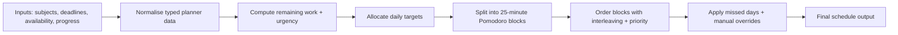

# Study Planner Pro

A professional Next.js study planning dashboard built as a portfolio-grade example of React application architecture. The app turns subjects, deadlines, daily availability, completed hours, missed days, and manual session moves into an automatically generated Pomodoro-based study schedule.

This project is intentionally structured to demonstrate production-facing frontend skills: feature-first folders, clean state boundaries, API isolation, schema-driven forms, cache synchronization, and testable domain logic.

---

## Problem Statement

Students often plan study time manually, which leads to inconsistent workloads, last-minute cramming, and missed sessions when availability changes. This project solves that by generating a realistic plan from constraints — deadlines, availability, progress, and priorities — while still allowing manual adjustments.

---

## CV / Portfolio Description

**One-line**: Built a Next.js study planner that generates Pomodoro-based schedules from deadlines, availability, and progress using evidence-informed scheduling rules.

**Short paragraph**: Study Planner Pro is a feature-first React/Next.js dashboard that transforms real constraints (deadlines, availability, priorities, and progress) into a realistic study plan. It separates server-state with React Query, isolates API access behind Axios, validates forms with Formik/Yup, and keeps the scheduling engine pure and unit-tested for reliability.

**Suggested CV entry**:

> **Study Planner Pro — Next.js / React Portfolio Project**
> Built a feature-first study planning dashboard using Next.js, React, TypeScript, React Query, Axios, Formik, Yup, Context API, Tailwind CSS, and Vitest. Implemented a pure Pomodoro-based scheduling engine, schema-validated planner forms, API-backed persistence, localStorage hydration fallback, focused app preference context, and unit-tested domain logic.

**Suggested LinkedIn / GitHub description**:

> A professional Next.js study planner demonstrating React Query server-state management, Axios API isolation, Formik/Yup form validation, focused Context API usage, and pure testable Pomodoro scheduling logic.

---

## Tech Stack

- **Next.js App Router** — routing, metadata, API routes, and production builds
- **React** — component composition, custom hooks, controlled forms, and Context API
- **TypeScript** — planner contracts, payloads, and domain logic
- **React Query** — server-like planner state, cache ownership, loading state, and sync mutations
- **Axios** — API client boundary
- **Formik** — subject/settings form state
- **Yup** — reusable validation schemas and error messages
- **Tailwind CSS** — responsive UI styling
- **Vitest** — pure scheduling and domain action tests

---

## Features

- Deadline-aware study schedule generation
- Subject creation, editing, progress tracking, and deletion
- Daily availability and start-date planning controls
- 25-minute Pomodoro focus blocks with short and long break suggestions
- Evidence-based scheduling: distributed practice, deadline pressure, interleaving, and priority weighting
- Drag-and-drop session rescheduling with undo and clear overrides
- Missed-day simulation that skips blocked dates and shifts the plan forward
- LocalStorage hydration with API synchronisation through `/api/planner`
- Explicit loading, saving, and sync-error states
- Light/dark theme preference through focused app context

---

## Scientific Basis (Evidence-Informed)

The scheduling logic is based on widely accepted learning science principles rather than arbitrary heuristics:

- **Spacing effect**: work is spread across available days to reduce cramming.
- **Distributed practice**: each subject receives steady daily targets when possible.
- **Interleaving**: repeated blocks of the same subject are penalised to encourage rotation.
- **Deadline pressure**: subjects closer to deadlines receive higher priority.
- **Pomodoro technique**: work is chunked into 25-minute focus blocks with recommended breaks.

These ideas are implemented as explicit scoring and distribution rules inside the scheduling engine so the plan remains consistent and explainable.

---

## Architecture

The planner feature lives in `src/features/planner` and is split by responsibility:

- `components` — screen composition and presentational UI for the planner dashboard
- `hooks` — React orchestration for server-like planner state and planner actions
- `api` — Axios-backed calls to the Next API route
- `domain` — pure transformations for planner actions, selectors, and form mapping
- `schemas.ts` — Formik/Yup validation contracts for planner settings and subject forms

Shared infrastructure stays outside the feature:

- `src/lib/http-client.ts` — Axios client configured for `/api`
- `src/lib/query-client.ts` — React Query defaults
- `src/lib/planner.ts` and `src/lib/planner-utils.ts` — pure schedule generation and date math
- `src/lib/storage.ts` — localStorage hydration and persistence fallback
- `src/context/app-preferences-context.tsx` — app-wide theme preference only

### Project Structure

```
src
  app
    api/planner        Next API persistence endpoint
    layout.tsx         App shell metadata and providers
    page.tsx           Route entrypoint
  context              Cross-cutting app preferences
  features/planner
    api                Planner API client
    components         Planner dashboard UI
    domain             Pure actions, selectors, and form mappers
    hooks              Query/state orchestration
    schemas.ts         Yup validation schemas
  lib                  Shared infrastructure and pure scheduler
  types                Shared planner contracts
```

---

## Architecture Decision Record

### React Query

Used for planner data because it behaves like server state: it can be fetched from `/api/planner`, cached, updated with mutations, and hydrated from localStorage as a fallback. Components and pure planner logic do not know how HTTP requests are made.

### Axios

Used only at the data access boundary. Components and pure planner logic do not know how HTTP requests are made.

### Formik and Yup

Used for subject creation, subject editing, and settings because those flows need controlled values, validation, submit handling, and readable error messages. Yup centralises validation rules and user-facing form errors in one place.

### Context API

Used only for app-wide preferences, currently theme mode. Planner data is not stored in Context because React Query is a better fit for async/cache state.

### Pure Domain Logic

Schedule generation, planner actions, selectors, and form mapping are kept outside components so they can be tested and reused. The schedule engine splits work into 25-minute Pomodoro blocks, spreads work across available days, and rotates subjects when multiple tasks compete for the same day.

---

## State Boundaries

**React Query** owns the planner snapshot because it is server-like data that can be fetched from and synced to `/api/planner`. The query starts from localStorage so the dashboard renders immediately and remains useful offline.

**Formik** owns form state for settings, subject creation, and subject editing. Yup schemas define validation messages and numeric limits in one place.

**The scheduler** stays pure. It receives `PlannerData`, returns a `PlanResult`, and does not know about React, localStorage, Axios, or forms.

**Context** is intentionally narrow. The only context in the app is for cross-cutting theme preference; it does not replace query state or form state.

---

## Scheduling Logic Overview

The planner converts user inputs into a stable, testable schedule using a repeatable pipeline:

1. Normalise inputs into typed planner data (subjects, deadlines, progress, availability).
2. Compute remaining work per subject and infer urgency from deadlines.
3. Allocate daily targets using distributed practice and deadline pressure.
4. Split work into 25-minute Pomodoro blocks.
5. Order blocks using interleaving and priority weighting to avoid back-to-back monotony.
6. Apply missed-day shifting and manual overrides without breaking totals.

This logic lives in pure, framework-agnostic functions so it can be unit tested and reused.

### Scheduling Pipeline



Breaks are suggested after each focus block: 5 minutes normally and 15 minutes after every fourth Pomodoro in a day.

---

## What This Demonstrates

- Separating server/cache state from form state, local UI state, and pure derived schedule output
- Using React Query for async planner data instead of replacing it with Context
- Using Context only for app-wide preference state
- Keeping API access isolated behind Axios client modules
- Keeping scheduler logic independent from React so it can be tested directly
- Applying Formik/Yup only where real forms need validation and touched/error handling
- Maintaining recruiter-readable documentation and repeatable validation commands

---

## Interview Talking Points

- Why planner data belongs in React Query instead of Context
- How Formik and Yup improve form consistency and validation readability
- How API calls are isolated behind a feature API module
- How the schedule engine remains pure and testable
- How localStorage hydration works as a fallback while preserving API sync
- How the feature-first folder structure makes the codebase easier to scale

---

## Local Development

```bash
npm install
npm run dev
```

Open `http://localhost:3000`.

## Verification

Run the guardrails before shipping changes:

```bash
npm run lint
npm run test
npm run build
```

---

## Demo and Screenshots

- Live demo: TODO (add link)
- Screenshots


